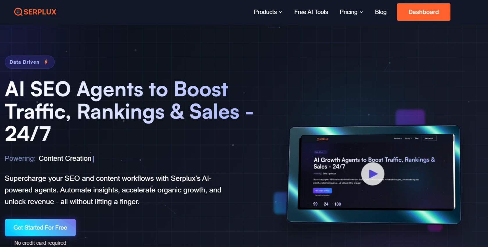
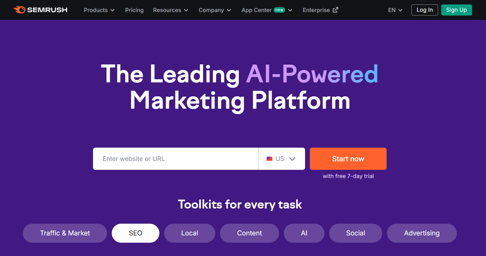
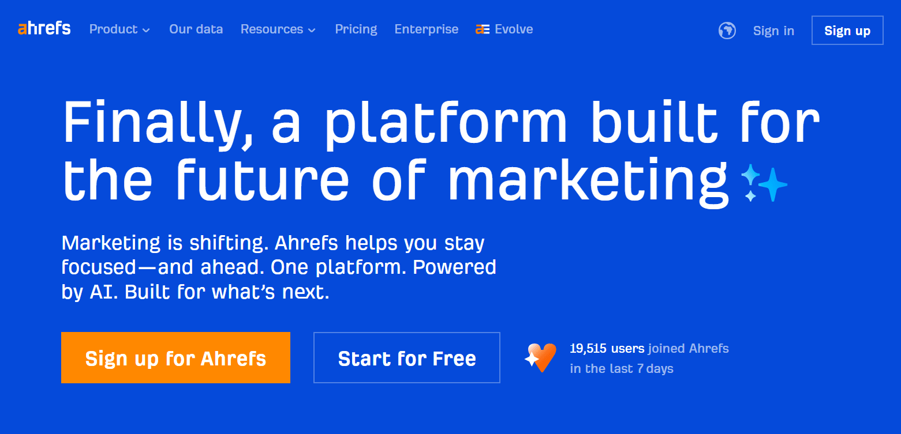
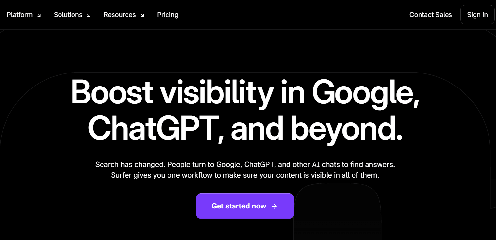
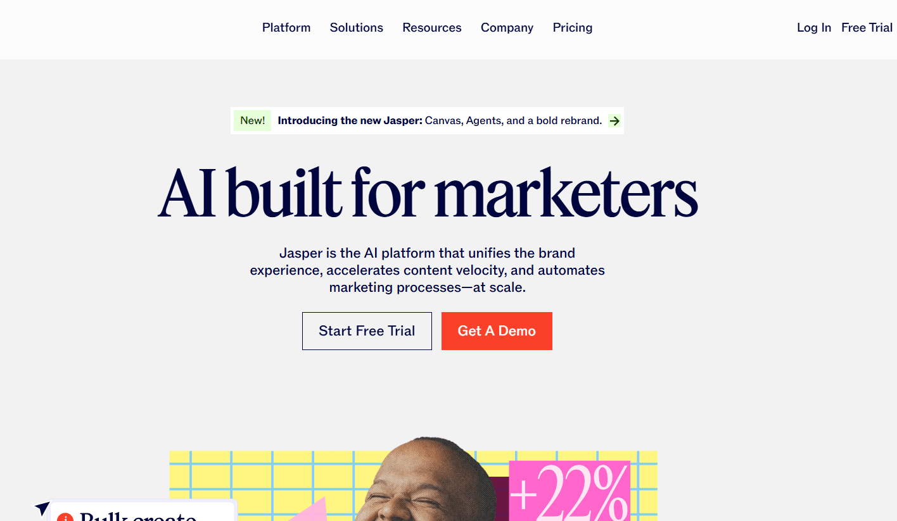
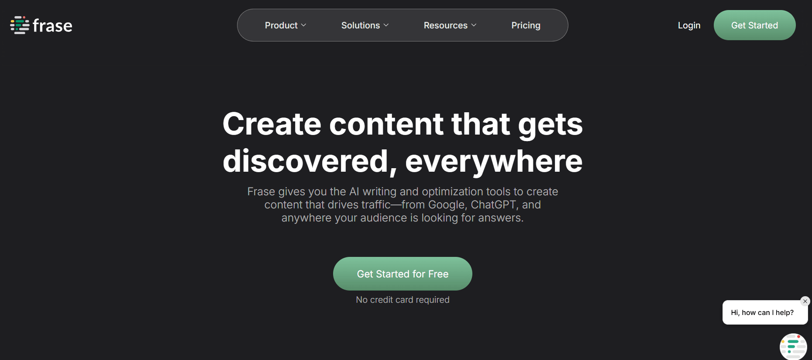
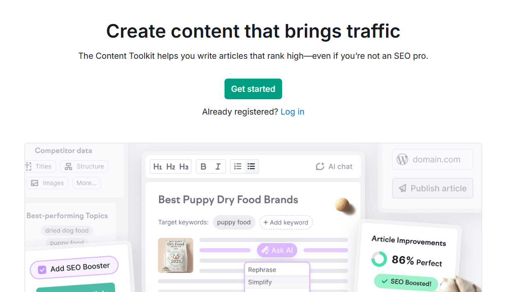
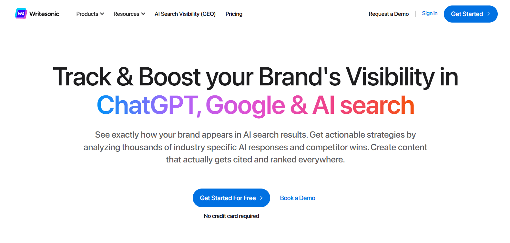
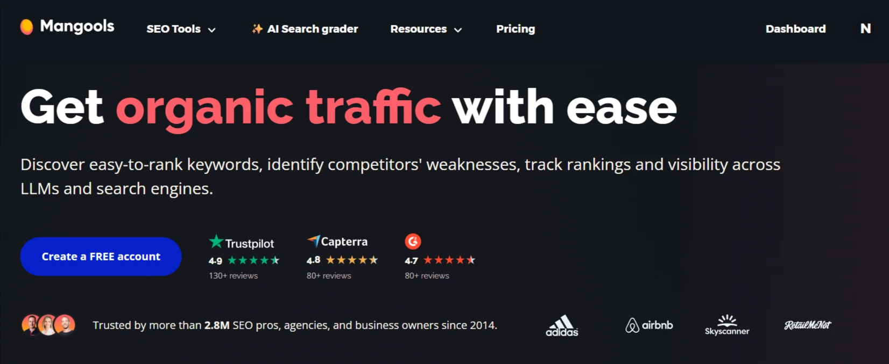

## I. Introduction: The Dawn of AI SEO Agents in 2025

The landscape of Search Engine Optimization (SEO) has undergone a profound transformation, evolving from a rigid focus on keyword matching to a dynamic, conversational paradigm. Historically, SEO strategies centered on keyword density and page-level relevance, with users navigating static ranked lists of linked pages. This traditional approach involved a straightforward interaction: a query, followed by a list of results, a click on a link, and potentially a new search.

However, the advent of Artificial Intelligence (AI) has fundamentally reshaped this pattern. AI search now prioritizes conversational prompts and passage-level context, reflecting a more natural human interaction. Prompt lengths in AI interfaces, such as ChatGPT, average significantly longer than traditional search queries, indicating a shift towards more complex and nuanced user intent. Users are increasingly engaging in multi-prompt sessions, where the AI retains context from previous interactions, allowing for a dynamic and evolving search experience. This necessitates that content is structured to answer follow-up questions and seamlessly connect related topics, with AI systems valuing semantic relevance and topical authority over simple keyword density. Furthermore, AI search transforms content by synthesizing responses from multiple sources, rather than merely displaying direct snippets, demanding a new approach to content optimization.

### What are AI SEO Agents? Defining the Next Generation of SEO Tools

AI SEO agents represent the vanguard of this evolution, functioning as AI-powered assistants designed to automate and manage a multitude of SEO tasks with minimal human intervention. These agents can be conceptualized as highly efficient and tireless SEO team members, capable of analyzing blogs for urgent updates, recommending internal links based on intelligent keyword clusters, and instantly alerting users to ranking drops, all without requiring direct human action.

The efficacy of these agents stems from their integration of several advanced technologies:

- **Natural Language Processing (NLP):** This technology enables AI SEO agents to comprehend search intent and content meaning beyond mere keywords, discerning the underlying _why_ behind user searches. NLP plays a crucial role in identifying user intent, thereby enhancing content relevance and improving search rankings.
- **Machine Learning (ML):** Through ML, these agents learn from vast datasets, identifying trends and past results. This continuous learning process allows them to refine recommendations, prioritize tasks effectively, and even predict potential ranking shifts before they occur.
- **Real-time Data Integration:** To ensure they operate with the most current information, AI SEO agents integrate real-time data from various sources, including website analytics, Google Search Console, Google Trends, Keyword Planner, and rank trackers.
- **Automation Engines:** These engines power the underlying workflows, enabling agents to autonomously generate content briefs, suggest internal links, and scan for technical SEO issues, among other tasks.

The distinction between AI SEO agents and traditional SEO tools is significant. Traditional tools typically provide raw data—such as keyword volumes, backlink statistics, or technical audit results—leaving the interpretation and decision-making entirely to the user. In contrast, an AI SEO agent offers actionable, tailored recommendations and ready-to-implement action plans, functioning more like a co-pilot that not only provides direction but also actively assists in reaching the destination. These agents automate entire workflows, including comprehensive audits and keyword planning, a capability far beyond the scope of traditional tools that require manual report pulling and interpretation.

Furthermore, AI SEO agents differ from general AI chatbots like ChatGPT. While chatbots excel in natural language interaction and content generation, AI SEO agents augment this conversational ability with deep integration of SEO-specific data, robust automation, and real-time monitoring. Chatbots lack direct access to specialized SEO tools or live SERP data and are unable to perform or interpret technical audits. Conversely, AI SEO agents can provide detailed SERP breakdowns, analyze search intent, and offer technical solutions for developers, content adjustments for writers, and internal linking optimizations.

### The Impact of AI on SEO Professionals

The integration of AI into SEO workflows has had a profound impact on the industry. Data indicates that AI now automates approximately 44.1% of core SEO tasks, with a substantial 75.4% of professionals reporting enhanced scalability in their operations. A significant majority, 86% of SEO professionals, have already incorporated AI into their strategies, and 65% of them have observed improved results as a direct consequence.

This widespread automation and the reported gains in productivity suggest a fundamental evolution in the role of an SEO professional. As AI assumes responsibility for tasks such as technical audits, content structuring, and initial keyword research , the demand for human expertise shifts towards areas where AI currently exhibits limitations. This includes strategic planning, ethical link-building, the creation of truly creative and emotionally resonant content, and the cultivation of genuine relationships. The implication is that future SEO education and career trajectories will increasingly emphasize higher-order cognitive skills and creative problem-solving, moving away from the more repetitive, execution-focused tasks.

Moreover, the necessity for human oversight is a recurring theme. While AI-generated content has advanced considerably, it often lacks the originality, emotional nuance, and unique perspective that human storytelling provides. The need for human review and the caution against potential over-optimization underscore that a hybrid approach, blending AI-driven insights with human judgment, is paramount for future SEO success. This indicates that AI's role is not to entirely replace human professionals but to augment their capabilities, freeing them to concentrate on quality control, strategic interpretation, and creative refinement. This collaboration between human and AI leads to more effective, ethical, and ultimately superior SEO outcomes.

### Comparative Overview of Top AI SEO Agents

To provide an initial understanding of the market, the following table offers a high-level comparison of prominent AI SEO agents, highlighting their primary focus and starting price points.

| Tool Name                  | Best For (Primary Use Case)       | Key AI Features (1-2 highlights)                                          | Starting Price (Monthly)   |
| -------------------------- | --------------------------------- | ------------------------------------------------------------------------- | -------------------------- |
| Serplux                    | All-in-one AI Growth & Automation | AI SEO Agent Suite, Automated Article Generation, Plagiarism-Free Content | $0 (Free Plan)             |
| SEMrush                    | Comprehensive SEO Suite           | Content Toolkit, Semrush Copilot, AI Overview Tracking                    | $60 (Content Toolkit)      |
| Ahrefs                     | Backlink Analysis & Content AI    | AI Content Helper, Brand Radar AI, Automated Technical SEO Fixes          | $129 (Lite Plan)           |
| Surfer SEO                 | Content Optimization              | Surfer AI (Article Generation), AI Content Humanizer, Auto Internal Links | $99 (Essential Plan)       |
| Jasper AI                  | AI Content Creation & Marketing   | SEO Mode (SurferSEO Integration), Custom Apps, Plagiarism Checker         | $39 (Creator Plan, Ann.)   |
| SE Ranking                 | All-in-one SEO & AI Visibility    | AI Search Toolkit (AIO, ChatGPT, Gemini Trackers), AI Writing Tools       | $52 (Essential Plan, Ann.) |
| Frase io                   | Content Research & Optimization   | Rank-Ready AI Documents, Content Briefs, AI Writer, SEO Analytics         | $45 (Starter Plan)         |
| ContentShake AI by Semrush | SEO Blog Writing                  | SEO Content Briefs, AI Image Generation, Article Optimization             | $60 (Unlimited Plan)       |
| Writesonic                 | End-to-End AI Content & SEO       | AI Article Writer, AI Search Visibility, Automated Technical SEO Fixes    | $39 (Lite Plan, Ann.)      |

## II. Navigating the AI Landscape: How to Choose Your Ideal AI SEO Agent

Selecting the most suitable AI SEO agent requires a strategic approach, beginning with a clear understanding of an organization's specific SEO objectives and operational context. Different tools are engineered to excel in distinct areas, whether it be in-depth keyword research, sophisticated content optimization, or granular technical SEO audits. Therefore, identifying the primary needs of an SEO strategy serves as the foundational step in guiding the selection process towards the most appropriate tool. Furthermore, the size and structure of the team, the anticipated volume of content production, and the allocated budget are crucial factors that must be carefully considered.

### Essential Evaluation Criteria for AI SEO Agents

#### 1. Ease of Use and User Interface (UI)

An intuitive and user-friendly interface is paramount for the successful integration of any AI tool into existing workflows. The complexity of AI operations should ideally be managed behind the scenes, allowing the team to adopt the tool without requiring extensive training. Tools featuring clean interfaces and comprehensive, easy-to-understand documentation are more likely to foster higher user adoption rates.

The emphasis on user-friendliness is not merely a matter of convenience; it directly correlates with the return on investment (ROI) of an AI tool. Data indicates that companies prioritizing user-friendly AI solutions tend to achieve a 20% higher success rate. This observation highlights a direct relationship: if an AI SEO agent proves difficult to learn or integrate into daily tasks, its potential benefits may be significantly diminished by low adoption rates and wasted training resources. Consequently, evaluating the UI and overall user experience is not just about simplifying operations but is a critical factor in realizing the tool's intended value and achieving desired business outcomes.

#### 2. Total Cost of Ownership (TCO)

When evaluating AI SEO agents, it is crucial to look beyond the initial purchase price and consider the total cost of ownership (TCO). This encompasses ongoing expenses such as maintenance, necessary training for staff, continuous support, and any additional credits that might be required for extended usage. AI tools often feature complex pricing structures that can extend well beyond the upfront cost, potentially including hidden fees for subscriptions, customizations, or integrations. The overall ROI must unequivocally justify the total financial investment.

Many prominent tools in the market offer tiered pricing models. The frequent mention of "extra costs for add-ons" or "limited credits" suggests that the advertised starting price may not accurately reflect the true cost for comprehensive usage or for scaling operations. For instance, SE Ranking's costs can escalate considerably depending on keyword volume or the inclusion of add-ons , and Surfer SEO's AI Tracker is offered as a separate add-on. This indicates that a seemingly affordable base plan could quickly become expensive as usage expands, potentially leading to budget overruns if the TCO is not thoroughly assessed during the decision-making process.

#### 3. Vendor Reputation and Proven Track Record

Thorough research into the vendor's history and customer reviews is essential. It is advisable to seek out tools with a proven track record and strong testimonials from users within the specific industry. Reputable vendors should be able to provide concrete case studies that clearly demonstrate measurable results. In a market increasingly saturated with AI tools, a vendor's reputation serves as a reliable indicator of product quality and reliability. It is important to look beyond superficial marketing claims and seek tangible evidence of the tool's performance in real-world scenarios. Vendors with strong reputations are typically transparent and willing to provide detailed case studies showcasing quantifiable success in comparable business environments.

#### 4. Speed to Value Results

Before committing to a purchase, it is prudent to request demonstrable proof of the tool's effectiveness. Reliable vendors will offer case studies or demo results that illustrate how their tool has successfully addressed specific business challenges. Key indicators of a successful AI implementation include metrics such as efficiency gains, reductions in errors, and improvements in user satisfaction. The objective should be to select tools that can deliver tangible, measurable results within a relatively short timeframe, ideally within three to six months. Whether the desired outcome is increased productivity, reduced operational costs, or enhanced customer satisfaction, the chosen tool should come with clear evidence of its real-world effectiveness, rather than relying solely on promises.

#### 5. Data Security and Privacy Compliance

Data security and privacy are non-negotiable considerations when selecting an AI SEO agent. It is imperative to ensure that the chosen tool complies with all relevant data protection regulations, such as GDPR. Prospective users should inquire about the vendor's data handling practices, the encryption methods employed, and any pertinent certifications to guarantee the secure management of their data. The importance of robust security measures cannot be overstated, as data breaches can have severe financial and reputational consequences. Therefore, verifying practices such as data encryption, regular security audits, and adherence to industry regulations is critical.

#### 6. Seamless Integrations

The ability of an AI SEO agent to integrate seamlessly with existing tools and platforms is crucial for streamlining workflows and maximizing overall efficiency. This includes compatibility with widely used platforms such as Google Docs, WordPress, Google Search Console, Ahrefs, and Semrush. Effective integration minimizes manual data transfer, reduces the risk of errors, and allows for a more cohesive and automated SEO process.

#### 7. AI Capabilities and Output Quality

A thorough assessment of the AI features offered is essential. This includes examining capabilities such as Natural Language Processing (NLP)-based keyword inclusion, the generation of AI-driven outlines, real-time content scoring, automated schema markup generation, and the provision of predictive analytics. It is also critical to critically evaluate the quality and factual accuracy of AI-generated content, recognizing that human review remains indispensable for ensuring nuance, originality, and factual correctness.

The evolving nature of AI search means that content is no longer solely written for human readers but also for the machines that interpret and present information to humans. AI models need to quickly understand content and deem it trustworthy enough to cite. This suggests that traditional SEO metrics, such as keyword density, may become less significant compared to clarity, structured presentation, and semantic coherence. Consequently, a key capability for modern AI SEO agents is their ability to guide content creation towards "AI-citable" formats. This involves structuring content with clear headings, providing quick and direct answers, utilizing bullet points and tables, and incorporating relevant schema markup. Tools that actively facilitate the formatting of content for optimal Large Language Model (LLM) parsing will offer a significant competitive advantage in the continually evolving search engine results pages (SERPs).

#### 8. Scalability

The chosen AI SEO agent should possess the capacity to scale with the evolving needs of the business. This includes supporting increasing volumes of content, accommodating a growing number of users, and managing an expanding portfolio of projects. A tool that can seamlessly adapt to growth ensures long-term utility and prevents the need for costly and disruptive migrations in the future.

#### 9. Ethical Considerations

Finally, it is important to be mindful of the ethical implications associated with AI-driven SEO. This includes avoiding practices that could lead to over-optimization or the generation of AI-spam. Maintaining content authenticity and trustworthiness is paramount, as search engines increasingly penalize manipulative tactics. The responsible use of AI ensures that SEO efforts remain aligned with best practices and build genuine value for users.

## III. The 10 Best AI SEO Agents in 2025: An In-Depth Analysis

### 1. Serplux AI SEO Agent and Article Automation Platform

Serplux positions itself as an AI-powered growth partner, specifically engineered to automate SEO and digital marketing processes. The platform aims to remove the guesswork from these tasks and reduce the reliance on expensive human specialists. It achieves this by integrating and pulling fresh, accurate data from leading SEO sources such as Ahrefs and DataForSEO, which it then uses to analyze niche markets and uncover successful competitor strategies.

The platform is bifurcated into two core offerings: the Serplux AI SEO Agent capabilities and the Serplux Article Automation Platform capabilities.

Serplux AI SEO Agent Capabilities :

- **SEO Strategy Generator:** This intelligent AI agent meticulously scans a user's website, identifies existing gaps in its SEO performance, and then delivers a customized, data-backed roadmap. This roadmap is designed to increase organic traffic and improve search visibility, all through a fully automated process.
- **Backlink Strategy Generator:** This AI agent is designed to accelerate organic traffic growth by identifying high-authority link-building opportunities. It also helps in constructing custom outreach plans, thereby facilitating ranking improvements without the need for additional advertising expenditure.
- **Keyword Analyzer:** This powerful AI agent leverages advanced AI to provide immediate, actionable insights into keywords. It aims to transform SEO strategies by eliminating the need for guesswork regarding which keywords are most effective for driving traffic and dominating search rankings.
- **UX Review Generator:** This tool offers instant user experience (UX) audits and provides suggestions for conversion optimization. The AI automatically analyzes the website to identify and help fix friction points, which is intended to lead to higher user retention and increased sales.
- **Audience Insights Analyzer:** This feature utilizes AI-powered insights to uncover real-time audience behaviors, buying patterns, and conversion triggers. This capability is designed to empower smarter marketing strategies and enhance ROI by providing data-driven understanding of the target audience.
- **Competitor Analysis:** Serplux’s tools enable users to track and analyze the content, keywords, backlinks, and overall SEO strategies of their rivals. This functionality helps users discover successful tactics within their industry and adapt those winning approaches to their own marketing campaigns.

Serplux Article Automation Platform Capabilities :

- **SEO Article Automation Platform:** This platform is designed to produce daily, SEO-optimized, and humanized articles under a user's brand. It automates the publishing process, aims to boost rankings, ensures compliance with AI-detection standards, and adheres to SEO best practices, all while claiming zero operational overhead.
- **Blog Topic Ideas Generator:** This AI-powered tool instantly generates trending and SEO-friendly topics that are likely to resonate with the target audience. It analyzes current search trends and user intent to deliver content ideas that can drive traffic, improve rankings, and keep the content strategy ahead of the curve.
- **Blog Topic Researcher:** This feature allows users to quickly analyze what topics are trending, what content is currently ranking well, and what drives traffic. It uncovers high-impact blog topics supported by real data, enabling the creation of content that is more likely to climb the SERPs and connect with the audience.
- **Blog Image Generator:** This tool enables the creation of visually appealing, "scroll-stopping" graphics in seconds, eliminating the need for design experience. The AI-powered image generator crafts stunning, brand-aligned visuals suitable for blogs, social media, advertisements, and other converting content.
- **AI Content Writer:** Beyond full articles, Serplux’s AI content writer can instantly generate a variety of SEO-optimized content, including blog posts, landing pages, product descriptions, and ad copies. Users simply input their topic or keywords, and the AI produces engaging, high-converting content tailored to their audience.
- **Plagiarism-Free Content:** A crucial feature, Serplux ensures that every piece of content generated is 100% original and passes plagiarism detection. The platform also incorporates built-in checks to verify content uniqueness and tone alignment, and to ensure overall SEO compliance.
- **Full Content Marketing Funnel Automation:** Serplux is designed to automate the entire content marketing funnel. This includes everything from initial keyword research and topic ideation to content writing, publishing, and continuous performance tracking, aiming to save significant time and scale digital marketing efforts efficiently.

**Overall Benefits & Integrations:** Serplux emphasizes automation and cost savings, intending to replace traditional specialists with continuous AI agents that deliver results faster and more affordably. It offers a centralized dashboard for managing optimization, updates, and content tailoring across various e-commerce platforms like Etsy, Amazon, eBay, and Shopify. The platform integrates with APIs from DataForSEO, Ahrefs, and Semrush to provide real-time keyword insights, including search volume, competition data, and long-tail keyword suggestions. It maintains a strong focus on ROI, providing actionable reports on traffic growth, ranking improvements, and conversion metrics. Designed to be user-friendly, it aims to provide smart recommendations and intuitive dashboards for SEO optimization, making it accessible even for non-technical users. For larger operations, Serplux is built for scalability, featuring multi-user collaboration tools, team dashboards, and client workspaces.

#### Pros

- Offers a comprehensive suite of AI-powered agents that cover a broad spectrum of SEO and content tasks, providing an all-in-one solution.
- Claims to automate insights, content workflows, and organic growth, potentially reducing manual effort significantly.
- Integrates with major SEO data sources like Ahrefs and DataForSEO, ensuring access to real-time and accurate insights.
- Emphasizes the generation of "humanized" and "plagiarism-free" content, directly addressing common concerns associated with AI-generated material.
- Capable of automating the _entire_ content marketing funnel, from initial ideation and research to writing, publishing, and performance tracking.
- Designed with a user-friendly interface, making it accessible even for non-technical marketers and founders.
- Early user feedback indicates positive results, such as noticeable increases in impressions and faster content creation.

#### Cons

- As a product launched in 2025 , Serplux is relatively new to the market. This means there is limited long-term user data and fewer comprehensive reviews compared to more established players.

- To enable and configure the **Article Automation Add-On**, you’ll need to connect with the Serplux support team at: `assistence@serplux.com`
- While the "Article Automation Platform" offers extensive capabilities and claims "zero operational overhead" , the nuanced nature of content creation, especially for highly specialized or sensitive topics, may still necessitate human oversight to ensure quality and brand alignment.
- The reliance on a credit system for operations could lead to variable costs depending on usage patterns, which might pose a challenge for budget predictability for some users.

#### Pricing

Serplux offers three primary pricing plans, designed to cater to different user needs and scales of operation :

| Plan Name         | Monthly Cost (Annual Equivalent)           | AI-Powered Creativity Credits | Key Features/Inclusions                                                                                                                                                                                                                                                           | Coming Soon Features                                                                             |
| ----------------- | ------------------------------------------ | ----------------------------- | --------------------------------------------------------------------------------------------------------------------------------------------------------------------------------------------------------------------------------------------------------------------------------- | ------------------------------------------------------------------------------------------------ |
| Free Plan         | $0/month                                   | 20/Month Credits              | All Free AI tools, All AI SEO Agents, Limited GPT-4o, Claude 3.5 Sonnet, & Claude 3 Opus access, Limited Image Generation, Unlimited Documents                                                                                                                                    | —                                                                                                |
| Growth Plan       | $9/month (Potential 30% savings annually)  | 500/Month Credits             | All Free AI tools with premium writing, All AI SEO Agents, Full Access to Latest Models, Data Driven Insights (Data for SEO), Unlimited Input/Documents, Standard Email Support, AI Competitor Analysis, Traffic Forecasting, SEO Performance Dashboards                          | AI Voice Generator, Answer The People, 1 Brand Voice                                             |
| Professional Plan | $36/month (Potential 30% savings annually) | 3000/Month Credits            | All Free AI tools with premium writing, Full Access to Latest Models & AI SEO Agents, Data Driven Insights (Data for SEO, Ahrefs, Semrush), Unlimited Input/Documents, Premium Email Support, Site Audit, AI Competitor Analysis, Traffic Forecasting, SEO Performance Dashboards | AI Voice Generator, Answer The People, Unlimited Brand Voices, Article Generation on Latest News |

Most operations within Serplux, particularly for its agents, typically consume around 5 credits per operation.

The pricing model adopted by Serplux, especially its Growth plan at $9/month and Professional plan at $36/month , stands out as remarkably competitive when compared to established industry players. For instance, SEMrush's main plans start at $139.95/month , Ahrefs' Lite plan begins at $129/month , and Surfer SEO's Essential plan is $99/month. This pricing structure suggests an aggressive market entry strategy, likely aimed at rapidly acquiring users, particularly individuals, startups, and small businesses. The implication is that Serplux is attempting to disrupt the market by offering a broad suite of advanced AI SEO features at significantly lower price points, making these capabilities more accessible. However, prospective users should carefully monitor how credit consumption aligns with their actual usage patterns to accurately predict costs.

### 2. SEMrush

SEMrush is recognized as a comprehensive, all-in-one SEO platform, catering to a diverse clientele including agencies, SEO consultants, content marketers, and businesses ranging from startups to large enterprises. Its core value proposition lies in consolidating a broad array of SEO tools into a single, unified platform, thereby aiming to streamline SEO efforts.

**AI SEO Features:**

- **Semrush Content Toolkit (formerly ContentShake AI):** This AI-powered platform is designed for the creation, optimization, and management of SEO-friendly content. It assists in generating content ideas, crafting content in a consistent brand voice, and leverages Semrush’s proprietary SEO data for creating robust content outlines. The toolkit also integrates AI image generation and an AI chat feature, and offers convenient one-click WordPress publishing. It is particularly recommended for generating SEO-friendly drafts, especially for users who may not be SEO experts, and it analyzes SERPs to optimize content for specific search intent.
- **Semrush Copilot:** This is an AI-powered assistant that delivers personalized SEO recommendations based on a user's specific SEO performance. It plays a crucial role in organizing SEO data, strategically addressing various issues by analyzing data from other Semrush tools like Site Audit, Backlink Gap, and Keyword Gap. Copilot also performs search performance analysis, provides regular updates on organic competitors to identify new opportunities, and issues daily alerts for critical issues and changes, effectively converting raw data into actionable, prioritized insights.
- **Other AI-related capabilities:** SEMrush also includes features for tracking AI Overviews, checking AI Snippet content, analyzing AI Snippet data, and monitoring competitors’ dynamics within AI snippets.

#### Pros

- Offers a comprehensive, all-in-one SEO toolkit, which significantly reduces the need for multiple specialized tools and streamlines workflows.
- Features strong data visualization capabilities and an accessible dashboard, making complex data more digestible.
- Provides detailed keyword metrics, competitive insights, and robust link monitoring functionalities.
- The Content Toolkit is highly user-friendly and an excellent choice for beginners, covering the entire content creation cycle from ideation to publishing.
- Semrush Copilot simplifies the prioritization of SEO action items and helps users navigate the extensive suite of Semrush tools effectively.
- Leverages Semrush's vast and proprietary SEO data to optimize AI-generated content, ensuring relevance and performance.

#### Cons

- The platform comes with a high cost, particularly when compared to some alternative tools, and offers limited flexibility on entry-level plans, often requiring extra costs for add-ons.
- Due to its extensive feature set, SEMrush can present a steep learning curve for new users, and its interface may occasionally feel cluttered.
- While generally reliable, data inaccuracies can sometimes occur.
- Semrush Copilot is exclusive to Semrush users, which limits its compatibility with other external tools or platforms.
- The Content Toolkit is less suited for large teams and enterprise users, potentially lacking the advanced collaboration or scalability features required by such organizations.
- Some stock images suggested by the Content Toolkit may not always be relevant to the content being created.

#### Pricing

SEMrush employs a tiered pricing structure for its main platform, with its AI features integrated into these plans or offered as separate tools:

| Tool/Plan Name          | Monthly Cost                                                 | Key Features/Inclusions                                                                                                                                                    |
| ----------------------- | ------------------------------------------------------------ | -------------------------------------------------------------------------------------------------------------------------------------------------------------------------- |
| Semrush Content Toolkit | $60/month                                                    | Content idea generation, brand voice content creation, Semrush SEO data, AI image generation, AI chat, one-click WordPress publishing, SEO-friendly drafts, SERP analysis. |
| Semrush Copilot         | Included with paid Semrush plans (starting at $139.95/month) | Personalized SEO recommendations, SEO data organization, search performance analysis, competitor updates, daily alerts, actionable insights.                               |
| Main Plans (e.g., Pro)  | Starts at $139.95/month                                      | Comprehensive SEO tools (keyword research, site audit, backlink analysis), often including access to Copilot and other AI-related capabilities.                            |
| Guru Plan               | Higher tier                                                  | More advanced features and higher limits.                                                                                                                                  |
| Business Plan           | Custom pricing                                               | Highest tier, tailored for large enterprises with maximized data reach and dedicated support.                                                                              |

SEMrush's approach to pricing its AI features reveals a strategic bundling decision. The Semrush Content Toolkit, a dedicated AI content creation tool, is offered at a fixed price of $60/month. In contrast, the more analytical AI Copilot, which provides personalized SEO recommendations and actionable insights , is integrated into SEMrush's broader, more expensive main platform plans, starting at $139.95/month. This indicates that the Content Toolkit is positioned as an accessible entry point for content creators primarily focused on writing. However, the full analytical power of SEMrush's AI is reserved for users who are already invested in the comprehensive SEMrush ecosystem. This bundling strategy encourages users to subscribe to the higher-tier, more expensive plans to unlock advanced AI analytical capabilities, demonstrating how AI features are strategically utilized to drive adoption and upsell within an established and extensive platform.

### 3. Ahrefs

Ahrefs stands as a prominent SEO platform, widely recognized for its extensive backlink database and its proprietary web crawler, AhrefsBot. Headquartered in Singapore, the company operates with a remote-first model. While Ahrefs is undeniably powerful and comprehensive, its pricing structure and inherent complexity often position it as a tool more suited for users with substantial SEO expertise and larger budgets, potentially posing a barrier for small businesses or individual users.

AI SEO Features :

Ahrefs has integrated AI capabilities across various aspects of its platform to enhance marketing, particularly in SEO and content creation.

- **Brand & AI Search:**

  - **Brand Radar:** This tool is designed to help users establish dominance in AI search by actively tracking brand mentions, citations, and overall sentiment across various AI chatbots.
  - **Rank Tracker:** Beyond traditional search engines, this tool is also utilized to monitor rankings within AI search environments, including local rankings.

- **Content Marketing:**

  - **AI Content Helper:** This feature is engineered to improve content quality through AI, accelerate content production workflows, and strengthen topical coverage by identifying relevant themes and entities.
  - **AI Content Grader:** This tool assists in evaluating the overall quality and comprehensiveness of content against top-ranking pages.
  - **Keywords Explorer:** This fundamental tool, enhanced with AI, allows users to understand what their target customers are searching for, uncover critical content gap insights, and discover high-intent keyword opportunities.
  - **Content Explorer:** This tool tracks web mentions and helps identify potential link prospects for outreach.

- **Website Performance:**

  - **Site Audit:** Beyond traditional auditing, this tool now audits and optimizes websites, with the notable capability to deploy technical SEO fixes directly to the website, potentially without requiring developer intervention.
  - **Web Analytics:** Provides in-depth insights into website traffic and continuously monitors website health on a 24/7 basis.

- **Local SEO:**

  - **GBP Monitor (Google Business Profile Monitor):** A newer tool designed to manage Google Business Profiles at scale, optimize them to attract more local customers, and ultimately dominate local search rankings.

- **AI Capabilities Across the Platform:** Ahrefs leverages AI to transform raw data into actionable insights, enabling users to operate faster, reduce manual effort, and make more informed decisions at scale. This includes tracking brand visibility across AI search and Large Language Models (LLMs), accelerating content production, enhancing topical coverage, offering AI-powered localization for global markets, and even detecting AI-written content to maintain editorial integrity. The platform's ability to deploy technical SEO fixes directly to websites is a significant automation feature. Ahrefs prides itself on its in-house infrastructure, which powers custom LLMs, enhances data with AI, and continuously expands its vast databases. It is also recognized as a leading SEO crawler by Cloudflare Radar and is listed among the top supercomputers by TOP500, underscoring its robust data infrastructure.

#### Pros

- Offers comprehensive backlink analysis and maintains an extensive backlink database, which is a core strength of the platform.
- Provides strong keyword data coverage and robust competitive analysis tools.
- Features a thorough Site Audit tool that delivers actionable recommendations, including recent enhancements like "Always-on Audits" and IndexNow integration, which facilitate automation and faster issue resolution.
- Leverages AI-powered insights across various functions, including content creation, brand visibility tracking, and technical SEO optimization.
- Offers extensive educational resources, such as tutorials, guides, an Academy, and webinars, to help users maximize the tool's value.
- Trusted by marketers from a significant percentage of Fortune 500 companies, indicating its industry credibility.

#### Cons

- Characterized by high pricing, which can make it less accessible for small businesses or individual users with limited budgets.
- Does not offer a free trial, requiring users to commit to a subscription to explore its full range of features.
- Provides limited flexibility and restrictive reporting options on its lower-tier plans.
- Occasional data gaps and variations in accuracy may occur depending on the specific niche or geographical region being analyzed.
- Compared to some competitors, Ahrefs exhibits relatively poor integration capabilities with other marketing tools.
- The platform is primarily focused on core SEO functionalities and tends to offer fewer broader marketing solutions.

#### Pricing

Ahrefs offers four primary pricing tiers, designed to cater to different user scales and needs :

| Plan Name                | Monthly/Annual Cost                         | Key Features/Inclusions                                                                                                                                                     |
| ------------------------ | ------------------------------------------- | --------------------------------------------------------------------------------------------------------------------------------------------------------------------------- |
| Lite                     | $129/month                                  | Ideal for small businesses/hobby projects. Includes 5 projects, 6 months of data history, 500 credits, 750 tracked keywords.                                                |
| Standard                 | $249/month                                  | Designed for freelance SEOs/marketing consultants. Includes 20 projects, 2 years of data history, unlimited monthly credits, 2,000 tracked keywords, AI Content Helper.     |
| Advanced                 | $449/month                                  | Tailored for in-house marketing teams. Accommodates 50 projects, 5 years of historical data.                                                                                |
| Enterprise               | $14,990/year                                | For large organizations/agencies with custom needs. Supports 100 projects, unlimited historical data, API access, advanced management tools, AI Content Grader integration. |
| AI Content Helper Add-on | Starts from $99/month (part of Content Kit) | Improves content with AI, accelerates production, strengthens topical coverage. (Content Kit also includes AI Content Grader).                                              |
| Brand Radar AI Add-on    | $199/month per index                        | Tracks brand mentions and sentiment across AI chatbots (Google AI Overviews, ChatGPT, Perplexity, Gemini, Microsoft Copilot).                                               |

Ahrefs, as an established and high-cost SEO tool , strategically positions its specific AI features, such as the "AI Content Helper" and "Brand Radar AI," as separate add-ons or bundles them into its higher-tier plans. This approach differs from Serplux's more inclusive AI feature set at lower price points. Ahrefs leverages its strong brand reputation and comprehensive core SEO data to upsell these AI capabilities, presenting them as advanced enhancements rather than foundational functionalities. This strategy is likely aimed at users already deeply committed to the Ahrefs ecosystem who are willing to pay a premium for cutting-edge AI insights and automation to further refine their SEO efforts.

### 4. Surfer SEO

Surfer SEO is primarily recognized as a content optimization tool, specifically designed to assist users in crafting content that aligns with SEO best practices to achieve higher search engine rankings. Its core functionality revolves around fine-tuning content based on detailed analysis of Search Engine Results Pages (SERPs).

AI SEO Features :

Surfer SEO has integrated several AI-powered tools to enhance content optimization and visibility across various AI-driven search environments.

- **AI Tracker (beta):** This tool allows users to monitor their brand's presence within AI tools like ChatGPT, providing insights into how their brand appears in AI-generated responses.
- **AI Content Detector:** This feature helps distinguish between human-written and AI-generated content, assisting publishers and content managers in evaluating text authenticity and maintaining content quality standards.
- **AI Content Humanizer:** Designed to rewrite AI-generated content to sound more authentic and human-like, this tool helps users humanize their content, potentially bypass AI detection, and streamline their content writing workflow.
- **Surfer AI:** This powerful tool is capable of generating ready-to-rank articles in minutes, handling the entire process of researching, writing, and optimizing content. Users can then review the final product and publish with confidence.
- **Surfy (AI writing assistant):** Built directly into Surfer AI, Surfy assists in editing, rephrasing, and refining content in real-time. It can respond to specific commands, such as backing up sentences with statistics, rewriting in an active voice, or providing examples.
- **Auto Internal Links:** This feature scans a user's site and automatically suggests and adds relevant internal links, which helps search engines like Google and AI tools like ChatGPT better understand topical relationships and display pages in the correct context.
- **Auto-Optimize:** This feature aims to boost the Content Score in seconds, providing quick optimization suggestions.
- **Plagiarism Checker:** This tool helps safeguard content from potential penalties by ensuring uniqueness.
- **Content Editor:** A central feature that provides real-time feedback on overall on-page optimization, including metrics related to content structure, word count, NLP-ready keywords, and image usage. It supports writing and optimizing content in any language.
- **Outline Builder:** This built-in tool assists in structuring content into a detailed outline, complete with unique potential headings and questions derived from SERP analysis.
- **Keyword Surfer:** This tool allows users to see the "fan-out queries" that ChatGPT runs to construct its answers, providing deeper insights into AI search behavior.

#### Pros

- Exceptional for content optimization, providing real-time suggestions within its Content Editor to enhance SEO performance.
- Delivers actionable insights derived from SERP analysis, clearly explaining the factors contributing to the performance of top-ranking pages.
- Boasts strong integrations with popular platforms like Google Docs and WordPress, which streamlines content workflows.
- The AI Content Humanizer is a valuable feature for making AI-generated content sound more natural and less robotic.
- Surfer AI offers the capability to generate full, ready-to-rank articles rapidly, significantly speeding up content production.
- Presents a user-friendly interface, making it approachable for users across various experience levels, including beginners.

#### Cons

- The sheer volume of data metrics can be overwhelming for absolute beginners, potentially leading to a steeper learning curve.
- There is a potential risk of over-optimization if users blindly adhere to all suggestions, which can inadvertently stifle the unique personality and voice of the writing.
- Its keyword research capabilities are somewhat limited when compared to dedicated keyword research tools, often necessitating the use of external platforms for comprehensive planning.
- Natural Language Processing (NLP) queries are not consistently included in the base plans, which may require higher-tier subscriptions or add-ons.
- The cost of subscription can be relatively steep for small businesses or individual solopreneurs operating with limited budgets.

#### Pricing

Surfer SEO offers tiered pricing plans, with an additional add-on for AI tracking :

| Plan Name         | Monthly Cost (Annual Equivalent) | Key Features/Inclusions                                                                                                      |
| ----------------- | -------------------------------- | ---------------------------------------------------------------------------------------------------------------------------- |
| Essential Plan    | $99/month ($79/month annually)   | 15 Content Editor credits, 20 Audits, 5 AI articles per month.                                                               |
| Scale Plan        | $219/month ($175/month annually) | 90 Content Editor credits, 140 Audits, 20 AI articles per month, supports 10 team members, white-label reports, API support. |
| Enterprise Plan   | Custom pricing                   | Tailored for large organizations with specific needs.                                                                        |
| AI Tracker Add-On | Starts from $95/month            | Tracks AI presence in ChatGPT, Google AI, Perplexity AI, and more.                                                           |

Additional AI credits can be purchased on demand.

Surfer SEO provides powerful AI features, including "Surfer AI" for full article generation and an "AI Content Humanizer" , with the aim of automating content creation. However, user feedback and the identified drawbacks highlight a critical point: the "potential for over-optimization" and the risk of stifling a distinct "writing personality". This creates a tension between efficiency and quality. While AI offers significant speed and scale, human intervention remains crucial to ensure that content is not only SEO-optimized but also engaging, unique, and avoids sounding generic or "robotic." This indicates that users must approach tools like Surfer SEO as sophisticated assistants rather than complete replacements for creative writing and critical judgment. Achieving optimal results necessitates a balanced approach where human expertise refines and guides the AI's output.

### 5. Jasper AI

Jasper AI is an AI-powered content creation tool primarily designed for generating SEO-optimized blogs, advertising copy, and email campaigns. It is tailored for marketers seeking to promote their products with unique messaging, leveraging a library of pre-made prompts. Developed by marketers for marketers, Jasper AI is trained on high-performing copy and emphasizes maintaining brand consistency across all generated content.

AI SEO Features :

- **SEO Mode:** This feature allows users to analyze their content against Search Engine Results Page (SERP) competitors and optimize it accordingly, facilitated by its integration with SurferSEO.
- **Custom Apps:** Users can build and publish Custom Apps that align any marketing task with their company's unique processes, promoting consistency across the team and accelerating business impact.
- **Integrations:** Jasper offers a growing marketplace of integrations, including notable platforms like Webflow, Google Docs, and Surfer SEO, to enhance AI processes and streamline workflows.
- **Chat:** Jasper's integrated chatbot can assist with various tasks, conduct quick research, and answer questions through human-like conversation.
- **Plagiarism checker:** An add-on for Copyscape, a plagiarism search tool, is available to scan generated content for originality and identify potential sources.
- **Core Capabilities:** Jasper AI is capable of generating keyword-optimized article outlines and full first drafts at scale, significantly boosting content production efficiency. It supports the creation of preferred workflows by integrating with tools like Zapier, Make, and Google Sheets. The platform also analyzes content for its rankability, safeguards against plagiarism, and can generate essential SEO elements like schema markup and FAQs.

#### Pros

- Highly effective for rapid content generation, producing various content types including short-form copy, long-form articles, ad copies, and emails.
- Offers a broad range of use cases and extensive customization options, allowing users to tailor content to specific needs.
- Features a user-friendly interface, making it relatively easy for new users to get started with the platform.
- Provides strong team collaboration capabilities, enabling real-time tracking of content production status across multiple users.
- Its integration with Surfer SEO is a significant advantage for optimizing content directly within the platform.
- Generates content that is claimed to be 100% original and plagiarism-free.
- Maintains good security controls and robust data safety measures.

#### Cons

- The pricing plans are frequently described as expensive by many users, potentially posing a barrier for smaller budgets.
- The tool may not curate highly technical content with sufficient accuracy, often requiring additional proofreading and research by human experts.
- Repetition of information can occur, particularly in longer-form articles, necessitating manual editing.
- There are additional costs associated with the plagiarism detection feature.
- Users new to AI writing tools may experience a steep learning curve before fully leveraging the platform's capabilities.

#### Pricing

Jasper AI offers three main pricing plans, with discounts available for annual billing :

| Plan Name     | Monthly Cost (Annual Equivalent) | Key Features/Inclusions                                                                                    |
| ------------- | -------------------------------- | ---------------------------------------------------------------------------------------------------------- |
| Creator Plan  | $49/month ($39/month annually)   | Unlimited AI-generated words, 50+ templates, 50 memories, one brand voice, Jasper Art access, Jasper Chat. |
| Teams Plan    | $125/month ($99/month annually)  | All Creator features, plus three user seats, support for 150 team members, three brand voices.             |
| Business Plan | Custom pricing                   | 10+ user seats, dedicated customer success manager, advanced tools for enterprise solutions.               |

A 7-day free trial is also available.

Jasper AI demonstrates a clear strength in "rapid content churning" and generating "SEO-optimized blogs, advertising copy, and email campaigns". Its effectiveness is particularly pronounced in marketing-oriented content, where its marketing-specific templates and brand voice memory are highly valuable. However, a notable limitation is its inability to "curate highly technical content properly". This indicates a specialization within the AI content generation landscape: Jasper is exceptionally effective for marketing content where speed, creativity, and adherence to brand voice are paramount. Conversely, it may not be the ideal standalone solution for deeply technical SEO content or highly factual, niche-specific articles that demand precise, expert-level detail and factual accuracy. Therefore, organizations dealing with complex or technical subject matter may need to combine Jasper AI's capabilities with significant human expertise or other specialized tools to ensure the necessary depth and accuracy.

### 6. SE Ranking

SE Ranking is positioned as a comprehensive, all-in-one SEO platform, providing a robust suite of tools designed to help businesses, digital marketers, and agencies optimize their online presence. It is frequently lauded for its combination of power and ease of use, often drawing comparisons to industry giants like Semrush and Ahrefs, but at a more accessible price point.

AI SEO Features :

SE Ranking has proactively adapted to the evolving search landscape by integrating a dedicated AI Search Toolkit.

- **AI Search Toolkit:** This new feature is specifically designed for effortlessly tracking a brand's visibility across various AI-powered search environments.
- **AI Overviews Tracker:** This tool analyzes a brand's visibility within Google's AI Overviews, providing insights into keywords, linked sources, mentions, and competitive brand performance.
- **AI Mode Tracker:** Monitors a website's appearance in Google's AI Mode, checking for brand mentions and links within AI-generated responses.
- **ChatGPT Tracker:** Tracks a brand's and website's visibility in ChatGPT answers, including how ChatGPT describes the business and mentions the brand.
- **Gemini Tracker:** Aims to improve brand visibility in Google Gemini, tracking specific mentions and benchmarking against competitors.
- **Perplexity Tracker:** Monitors a brand's and website's appearance in answers generated by Perplexity AI.
- **AI Visibility Research:** Evaluates a brand's overall visibility in Large Language Model (LLM) responses, assessing mention frequency and average position within AI-generated content.
- **AI Results Tracker:** Tracks how different LLMs frame a brand versus its competitors, monitoring mentions and links within AI responses.
- **AIO Research Tool:** Allows users to analyze any website's presence in Google's AI answers, not just their own.
- **Content Editor & AI Writing Tools:** Basic content creation and AI writing tools are included within the platform.

#### Pros

- Offers a consolidated, all-in-one SEO toolkit that covers essential functions such as keyword research, competitor analysis, backlink monitoring, website auditing, and rank tracking, reducing the need for multiple disparate tools.
- Features a user-friendly and intuitive interface, making it accessible for beginners while also supporting the needs of experienced users managing multiple projects.
- Provides high value for money, often being more affordable compared to competitors like Ahrefs and Semrush.
- Includes a comprehensive AI Search Toolkit for tracking brand visibility across multiple AI answer engines, a feature that addresses the evolving search landscape.
- Delivers in-depth automated website audits with actionable recommendations for fixes, helping to improve site health.
- Supports white-label reporting options, which is beneficial for agencies managing client accounts.
- Offers a generous 14-day free trial without requiring credit card details.

#### Cons

- Some users have noted concerns regarding data inaccuracy, particularly with respect to rank tracking.
- The depth of analysis provided by some tools within the suite may not fully meet the requirements of highly advanced or specialized SEO operations.
- Its backlink database is considered basic when compared to more specialized tools like Ahrefs.
- Specific functionalities, such as Local SEO and advanced Content Tools, are offered as paid add-ons, increasing the overall cost for users requiring these features.
- Provides limited insights into Pay-Per-Click (PPC) campaigns and lacks a built-in tool for link-building outreach.
- The interface, while generally user-friendly, can be somewhat cumbersome for certain common SEO tasks.

#### Pricing

SE Ranking offers three main pricing plans, with additional add-ons available. Annual subscriptions typically provide a 20% discount :

| Plan Name                   | Monthly Cost (Annual Equivalent)                                    | Key Features/Inclusions                                                                                              |
| --------------------------- | ------------------------------------------------------------------- | -------------------------------------------------------------------------------------------------------------------- |
| Essential Plan              | $65.00/month ($52.00/month annually)                                | 1 manager seat, 5 projects, 500 keywords daily, 50 AI Results Tracker, 5,000 AI Overviews research.                  |
| Pro Plan (Agencies' Choice) | Starts at $119.00/month ($95.20/month annually) for 2,000 keywords  | 3 manager seats, 30 projects, 100 AI Results Tracker, 10,000 AI Overviews research.                                  |
| Business Plan               | Starts at $259.00/month ($207.20/month annually) for 5,000 keywords | 5 manager seats, unlimited projects, API access, ChatGPT Research.                                                   |
| Content Marketing Add-on    | Starts at $29.00/month                                              | Includes Content Editor articles, AI Writer words, Plagiarism Checker, Content Idea Finder.                          |
| Local Marketing Add-on      | Starts at $9.00/month                                               | Access to localized SEO data, enhanced data on SERP rankings, local pack, mobile vs. desktop, local profile scoring. |

SE Ranking has proactively introduced an "AI Search Toolkit" that includes trackers for Google's AI Overviews, AI Mode, ChatGPT, Gemini, and Perplexity. This strategic move directly responds to the evolving search landscape, where AI-generated answers are becoming increasingly prominent. The fact that Google currently does not offer native tools for tracking AI-generated results creates a significant market opportunity that SE Ranking is actively addressing. This demonstrates a forward-thinking approach to "Generative Engine Optimization (GEO)," positioning SE Ranking as a potential leader in this new frontier of SEO by providing crucial analytics that other major platforms might not yet offer natively. This proactive adaptation could provide a competitive edge for users looking to optimize for AI-driven search results.

### 7. Frase io

Frase io is an AI-powered content optimization platform designed to streamline the entire process of researching, outlining, and refining SEO content. The platform leverages SERP data and Natural Language Processing (NLP) to analyze top-ranking pages, extract key topics, and generate keyword suggestions that are closely aligned with user intent. It is particularly well-suited for users whose primary focus is scaling written content with robust AI support.

AI SEO Features :

Frase io offers a comprehensive suite of AI SEO features, integrated into a streamlined content workflow:

- **Rank-Ready AI Documents:** This feature enables users to create long-form, SEO-optimized content based on in-depth SERP analysis, designed to be ready for immediate ranking.
- **Brand Voice:** Users can establish and maintain a consistent brand voice, which is then applied across all generated content.
- **Content Editor:** This tool facilitates quick outlining, continuous writing, and efficient rewriting of content with the assistance of AI.
- **Content Optimization:** Frase analyzes existing content and provides targeted suggestions to optimize it, aiming to help users outrank competitors.
- **Content Briefs:** The platform can generate well-researched content briefs from a single keyword in a matter of seconds, accelerating content planning.
- **Content Opportunities:** Users receive automated alerts and discover new avenues to enhance content performance and visibility.
- **SEO Analytics:** This feature integrates with Google Search Console data, transforming raw insights into actionable steps for SEO improvement.
- **Frase Answers:** An AI-powered website chatbot that leverages existing content to answer visitor questions and identify content gaps, thereby fueling content strategy.
- **AI Knowledge Base:** This feature allows users to power content creation by utilizing internal knowledge and contextual information.
- **Content Workflow:** Frase streamlines the content creation process through four main stages:

  1.  **Research:** It extracts search insights by analyzing top SERP results to identify key topics, headers, questions, and statistics, eliminating manual SERP digging. Users can analyze competitor content, visualize SERP metrics (e.g., word count, domain rating, heading count), and generate full-length, optimized content briefs using AI in just six seconds.
  2.  **Outline:** Frase helps build data-backed content briefs by generating detailed outlines with recommended headings, keyword suggestions, and competitor coverage, all automatically pulled from top-performing pages. Users can compile outlines by selecting headings from SERP results, organize them with a drag-and-drop interface, and use AI to generate heading and subheading ideas.
  3.  **Write:** The AI writer can convert an outline into a full draft rapidly. Users can customize the tone, length, and structure to match their brand voice and goals while maintaining SEO optimization. It can generate specific content outputs like blog intros, copywriting formulas, FAQs, and headings. The platform also supports collaboration with freelancers and coworkers.
  4.  **Optimize:** Frase analyzes content in real-time, highlighting missing elements based on competitor data and AI-engine preferences. It helps optimize existing pages or new drafts for high-ranking, AI-referenced content. Users can identify keywords to include, compare their content's keywords with competitors, and find areas to add references, improve readability, and enhance structure to signal value to AI engines.

#### Pros

- Offers streamlined content research and efficient brief generation, effectively eliminating the need for time-consuming manual SERP analysis.
- Provides strong AI writing support, complete with real-time suggestions and optimization recommendations based on competitor analysis.
- Aids in improving search rankings by analyzing high-ranking content to determine ideal article length, effective header structures, and strategic keyword usage.
- Features "Rank-Ready AI Documents" for instant, SEO-optimized full drafts, offering a quick content solution.
- Facilitates effective team collaboration through project tracking and shared folders.
- Integrates seamlessly with widely used platforms like Google Docs and WordPress, enhancing workflow efficiency.
- Receives positive user reviews, particularly praising its efficiency and ability to produce content that ranks well.

#### Cons

- Lacks a robust, built-in keyword research engine, often requiring users to rely on external tools for comprehensive SEO planning.
- The AI writer, despite its capabilities, may produce content that lacks original ideas or a consistent brand voice without significant human oversight and refinement.
- Grammatical inconsistencies can occasionally appear in AI-generated content.
- New users may experience a learning curve to fully grasp and utilize all of its features effectively.
- Advanced features, such as unlimited AI Writer access, are often locked behind a "Pro Add-On," increasing the overall cost.

#### Pricing

Frase io offers a free trial and several pricing plans, including a unique pay-as-you-go option for AI documents :

| Plan Name                               | Monthly Cost (Annual Equivalent)                                                        | Key Features/Inclusions                                                                                                                         |
| --------------------------------------- | --------------------------------------------------------------------------------------- | ----------------------------------------------------------------------------------------------------------------------------------------------- |
| Starter Plan                            | $45/month ($459 annually)                                                               | 1 user, 15 content projects/month, 1 brand voice, 50 pages tracked for opportunities, Unlimited AI Words.                                       |
| Professional Plan                       | $115/month ($1173 annually)                                                             | 3 users (up to 9 extra for $25/month each), 75 content projects/month, 5 brand voices, 200 pages tracked, Unlimited AI Words, Priority Support. |
| Enterprise Plan                         | Custom pricing                                                                          | Tailored for marketing teams with complex content workflows.                                                                                    |
| Rank-Ready AI Documents (Pay-as-you-go) | Starts at $3.50/document (volume discounts available, e.g., $2.00/document for 30 docs) | SEO-optimized full drafts generated instan                                                                                                      |

Frase io's primary strength lies in its content _optimization_ and _brief generation_ capabilities, which are driven by in-depth SERP analysis. While it offers an AI writer as part of its subscription plans, it also provides "Rank-Ready AI Documents" through a distinct pay-as-you-go model. This indicates a strategic flexibility in its offering: users can leverage Frase for its robust research and optimization guidance, and then choose their preferred content creation method. They can either write the content themselves, utilize the included AI writer, or purchase pre-generated "rank-ready" drafts as needed. This approach caters to diverse content production models, from those seeking comprehensive AI automation to those who prefer human writing augmented by strong AI-driven optimization guidance. This flexibility allows businesses to integrate Frase io into their existing workflows in a way that best suits their resources and content strategy.

### 8. ContentShake AI by Semrush

ContentShake AI, formerly known as Semrush Content Toolkit, is an AI-powered platform developed by Semrush specifically for the creation, optimization, and management of SEO-friendly content. It uniquely combines the capabilities of Large Language Models (LLMs) with Semrush's extensive SEO data to facilitate the creation of highly optimized web pages. The tool positions itself more as a "content creation companion" rather than a generic AI content generator, emphasizing its integrated approach.

Detailed Features :

- **SEO Content Briefs:** This feature assists in creating comprehensive content briefs. Users can specify a target keyword, select competitor articles for content examples, define word count and title, provide secondary keywords, and update the content structure (or use recommended ones), along with a meta description. The process is designed to be quick and smooth, often taking around five minutes. Briefs can be downloaded or shared via Google Docs.
- **Article from Scratch:** Based on an SEO content brief, ContentShake AI can draft an article. The editor dashboard includes an AI assistant, similar to ChatGPT, allowing users to ask questions, assign tasks, and refine prompts for better output. The AI leverages Open AI technologies. While it generates drafts, human input is often needed for refinement.
- **Image Generation:** ContentShake AI offers AI image generation capabilities, and users can also integrate images from Unsplash or existing search results. The platform emphasizes the value of unique images for better content and potential backlinks.
- **Article Optimization:** Integrated into the editor dashboard, this feature allows real-time content optimization, providing an immediate content score based on SEO factors, readability, and tone of voice.
- **Content Ideas:** The tool generates fresh content ideas on a weekly basis, tailored to user-preferred topics.
- **Brand Voice Creation:** Users can create custom brand voices to ensure consistent messaging across all generated content.
- **Multilingual SEO Article Generation:** ContentShake AI supports writing full-length, SEO-optimized articles in seven different languages: English, Dutch, French, German, Italian, Portuguese, and Spanish.
- **Seamless Publishing & Integration:** The platform allows direct publishing to WordPress or sending content to Google Docs, streamlining the workflow.
- **Chrome Extension:** A Chrome extension is available for generating and editing content on the fly.

#### Pros

- Extremely easy to use with a minimal learning curve, making it highly suitable for beginners in SEO and content creation.
- Integrates real-time keyword difficulty and search volume data directly into drafts, leveraging Semrush's extensive database for highly optimized content.
- Covers the entire content creation cycle, from initial ideation to final publishing, providing a comprehensive workflow solution.
- Excels at generating content ideas and quickly building structured SEO content briefs.
- Highly effective at improving existing content and drawing inspiration from top-performing competitor content without direct plagiarism.
- Offers robust brand voice creation capabilities and supports multilingual content generation.
- Provides seamless WordPress integration, which significantly saves time on formatting and media insertion during publication.
- Includes a generous free Chrome extension, allowing up to 50 uses per month without a subscription.

#### Cons

- AI-generated content, despite its quality, still requires human supervision to ensure accuracy and maintain originality.
- The limit of five SEO-boosted articles per month is not particularly generous for users with high content volume needs.
- The platform does not support uploading existing document or data files for analysis or optimization.
- There is a limitation on changing audience settings only three times per day.
- The 5,000-word limit may not be ideal for very long-form articles or comprehensive guides.
- The pricing, while straightforward, might be considered slightly expensive for a single-purpose tool, especially for solo entrepreneurs.

#### Pricing

ContentShake AI by Semrush offers a straightforward pricing model with a single "Unlimited" plan :

| Plan Name      | Monthly Cost | Key Features/Inclusions                                                                                                                                                                                                                                                                               |
| -------------- | ------------ | ----------------------------------------------------------------------------------------------------------------------------------------------------------------------------------------------------------------------------------------------------------------------------------------------------- |
| Unlimited Plan | $60/month    | Full access to all features: fresh content ideas, unlimited non-SEO-boosted article creation, 5 SEO-boosted articles/month (with full Semrush data, extras cost $30 for 10), AI image generation, brand voice creation, integrations (WordPress, Google Docs), Chrome extension (50 free uses/month). |

A 7-day free trial is available.

ContentShake AI, despite being a part of the broader Semrush suite, is priced as a standalone product at $60/month and focuses exclusively on content creation and optimization. This contrasts with Semrush's more extensive and typically more expensive main plans. The value proposition here is that it offers a highly specialized, user-friendly AI solution tailored for content marketers who may not require the full spectrum of SEO tools but demand advanced AI assistance specifically for writing and optimizing content. The distinction between "unlimited non-SEO articles" and a limited number of "SEO-boosted" articles suggests a tiered value within the single subscription: basic AI writing is abundant, while the deeper, data-driven SEO optimization, leveraging Semrush's proprietary data, is presented as a more premium offering. This strategy allows Semrush to effectively capture a segment of the market focused primarily on content, without requiring them to commit to the full, comprehensive platform.

### 9. Writesonic

Writesonic is an AI-powered content and SEO platform that has evolved significantly from a simple writing tool into an end-to-end solution for content generation, optimization, and publishing. By 2025, it had grown to serve over 10 million marketers globally. The platform distinguishes itself by connecting with major marketing tools such as Ahrefs, Google Search Console, and HubSpot to pull real-time data, enabling smarter content creation.

AI SEO Features :

Writesonic offers a comprehensive suite of AI SEO features, designed to provide an integrated marketing solution:

- **AI Search Visibility & AI SEO Automation Platform:** This feature monitors brand mentions across various platforms like ChatGPT and Claude, tracking rankings, sentiment, and citations in real-time. It also identifies citation gaps and content opportunities, providing actionable strategies to enhance visibility and outperform competitors in AI-driven search results.
- **SEO & Content AI Agent:** This agent allows users to pose questions and receive strategic insights, pulling data from Ahrefs and Keyword Planner to deliver and execute actionable SEO plans.
- **AI Article Writer 6.0:** This advanced tool creates long-form blog posts and SEO-optimized articles, capable of generating content up to 5000 words.
- **SEO Checker and Optimizer:** This feature supports SEO teams by assessing content optimization strength before publication. It identifies issues such as keyword dilution, missing headers, low paragraph density, and lack of media elements in both English and multilingual drafts.
- **Chatsonic (Custom AI Chatbot Builder):** This AI chat tool is designed for SEO and marketing, providing access to advanced AI models like GPT-4o, Claude 3.7 Sonnet, and Gemini 1.5 Pro. It includes web browsing, data analysis, and file upload capabilities.
- **Photosonic/Audiosonic:** These features enable AI image generation and the conversion of written text into lifelike speech using advanced voice synthesis.
- **Automated Technical SEO Fixes:** The platform can scan websites, identify technical issues, and deploy fixes directly, potentially eliminating the need for manual coding or developer intervention.
- **Content Audit:** Provides real-time SEO scoring to guide content improvement for higher rankings.
- **Core Capabilities:** Includes real-time data gathering, comprehensive competitor analysis, integrated fact-checking and citing, and in-depth web research.
- **Brand Consistency:** Users can train the AI on their existing content to ensure that newly generated content perfectly aligns with their established brand voice.
- **Multiple AI Models:** Provides access to and leverages advanced AI models, optimized for marketing and content creation.
- **Data Ingestion:** Capable of analyzing various file types and documents for insights and providing strategic recommendations.

#### Pros

- Offers fast content generation and supports a wide array of versatile use cases, making it a flexible tool for diverse marketing needs.
- Provides access to multiple advanced AI models, including GPT-4o, Claude, and Gemini, ensuring cutting-edge AI capabilities.
- Includes comprehensive built-in SEO tools, such as an SEO Checker & Optimizer and a dedicated SEO AI Agent, streamlining optimization efforts.
- Boasts strong integration capabilities with major SEO and marketing platforms like Ahrefs, Google Search Console, WordPress, and HubSpot.
- Features automated technical SEO fixes, which can save significant time and resources by addressing site issues directly.
- Supports customizable brand voice and offers multilingual output, catering to global marketing strategies.
- Presents a sleek and intuitive user interface, enhancing the overall user experience.
- Maintains enterprise-grade security measures, including bank-level encryption and compliance certifications.

#### Cons

- The quality of generated content can be variable, often requiring post-generation editing and human refinement to ensure consistency and accuracy.
- Lower-tier plans come with usage restrictions, which might limit scalability for growing businesses.
- The extensive breadth of features can make the interface feel overwhelming for some users.
- Lacks deep collaboration features, such as shared workspaces, which could be a limitation for larger teams.
- The quality of results is highly dependent on the precision and clarity of the prompts provided by the user.
- Some concerns have been noted regarding customer support responsiveness and the overall consistency of output.

#### Pricing

Writesonic offers five distinct pricing plans, with options for monthly or annual billing, where annual billing provides a 20% discount :

| Plan Name         | Monthly Cost (Annual Equivalent) | Key Features/Inclusions                                                                                                                                                                              |
| ----------------- | -------------------------------- | ---------------------------------------------------------------------------------------------------------------------------------------------------------------------------------------------------- |
| Lite Plan         | $49/month ($39/month annually)   | For solopreneurs. Includes 15 AI articles/month, 100 AI Agent generations, 6 SEO site audits (200 pages).                                                                                            |
| Standard Plan     | $99/month ($79/month annually)   | For small marketing teams. Includes 30 AI articles/month, Unlimited AI Agent generations, 15 SEO site audits (750 pages), AI Search Tracking (ChatGPT, Perplexity, Gemini, Google AI Overviews).     |
| Professional Plan | $249/month ($199/month annually) | For growing brands. Includes 100 AI articles/month, Unlimited AI Agent generations, 40 SEO site audits (1200 pages), AI Search Tracking (Claude, Microsoft Copilot, etc.), Dedicated GEO Strategist. |
| Advanced Plan     | $499/month ($399/month annually) | For scaling teams. Includes 200 AI articles/month, 60 SEO site audits (2500 pages), more users and projects.                                                                                         |
| Enterprise Plan   | Custom pricing                   | For large brands/agencies with tailored solutions.                                                                                                                                                   |

A free trial is also available.

Writesonic's evolution from a simple content generator to an "end-to-end SEO and publishing platform" is a notable development. Its integration of multiple advanced AI models (GPT-4o, Claude, Gemini), along with features like AI Search Visibility tracking, automated technical SEO fixes, and multimedia capabilities (Photosonic/Audiosonic) , indicates a strategic commitment to building a comprehensive AI ecosystem for marketers. This suggests that Writesonic aims to be a one-stop solution, reducing the need for users to subscribe to and manage various specialized tools. The implication is that Writesonic is targeting businesses that seek to centralize their AI-powered marketing efforts, offering a holistic solution that spans from content creation to SEO optimization and multi-channel publishing. This comprehensive approach could lead to greater workflow efficiency and potential cost savings by consolidating multiple subscriptions into a single platform.

### 10. Mangools

Mangools is a prominent SEO software suite known for its intuitive design and accessible pricing, making it a popular choice for beginners, small businesses, and bloggers. Headquartered in Bratislava, Slovakia, the platform is built around five core tools that cover essential SEO tasks. Its simplified approach and clear user interface position it as a strong alternative to more complex and expensive enterprise-level platforms.

#### Key Features

Mangools integrates a suite of five primary tools:

- KWFinder: A keyword research tool for finding long-tail keywords with low SEO difficulty and accurate search volumes.

- SERPChecker: A tool for analyzing search engine results pages (SERPs) and assessing keyword difficulty.

- SERPWatcher: A rank tracker that provides daily updates on keyword rankings for both desktop and mobile searches.

- LinkMiner: A backlink analysis tool for discovering and evaluating competitor backlinks.

- SiteProfiler: Provides a quick overview of a website's SEO authority and other crucial metrics.

#### AI SEO Features

Mangools has started to incorporate AI capabilities, notably with its AI Search Grader, a free Generative Engine Optimization (GEO) tool. This feature is designed to help users track and optimize their brand's visibility in AI-powered search engines and large language models (LLMs) such as Google Gemini, ChatGPT, and Perplexity. It evaluates brand visibility, average ranking, and provides an overall "AI Search Score" to help users understand how their brand is performing in the AI search landscape.

#### Pros

- User-Friendly Interface: Known for its clean, intuitive, and easy-to-navigate interface, making it ideal for beginners and those new to SEO.

- Affordable Pricing: The platform offers a clear and cost-effective pricing structure, with plans that are significantly cheaper than competitors like Ahrefs.

- Comprehensive Toolset: Provides a complete set of essential SEO tools, from keyword research to backlink analysis and rank tracking, all within a single suite.

#### Cons

- Limited Data and Scale: While comprehensive for its target audience, Mangools' databases are not as extensive as those of larger, more expensive competitors, which may be a limitation for large agencies or enterprises with very demanding needs.

- Fewer Advanced Features: It lacks some of the more advanced features, such as technical SEO audits that can deploy direct fixes, which are found in top-tier SEO platforms.

- No Direct AI Integration: Unlike Ahrefs, which integrates AI into core tools like Content Helper, Mangools' primary AI feature (AI Search Grader) is a separate, free tool, rather than a deep, platform-wide integration.

- Primarily Web-Based: It may offer less flexibility and fewer third-party integrations compared to competitors.

#### Pricing

Mangools' pricing is tiered and designed for accessibility, with all plans offering access to the full suite of five tools and the main difference being the usage limits. Annual billing offers a significant discount compared to monthly payments.

| Plan Name | Monthly Cost (Annual Billing) | Key Features/Inclusions                                                                                                                                                                                              |
| :-------- | :---------------------------- | :------------------------------------------------------------------------------------------------------------------------------------------------------------------------------------------------------------------- |
| Basic     | $29.90/month                  | Ideal for solopreneurs and freelancers. Includes 100 keyword lookups, 200 tracked keywords daily, 100 SERP lookups daily, and 100,000 backlink rows monthly.                                                         |
| Premium   | $44.90/month                  | Geared toward marketing teams. Includes 500 keyword lookups daily, 700 tracked keywords daily, 500 SERP lookups daily, and 500,000 backlink rows monthly, with support for multiple users.                           |
| Agency    | $89.90/month                  | Tailored for professional SEOs and agencies. Offers the highest limits, including 1,200 keyword lookups daily, 1,500 tracked keywords daily, and 1.2 million backlink rows monthly, with support for multiple users. |

## IV. Conclusion: Charting Your Course in AI-Powered SEO

The rise of AI SEO agents marks a turning point in the evolution of search engine optimization. These tools are reshaping the landscape by automating time-intensive processes, turning raw SEO data into actionable strategies, and adapting in real-time to the conversational, AI-driven nature of modern search. By doing so, they unlock a new level of efficiency, scalability, and precision that traditional methods simply can’t match.

For businesses seeking sustainable growth, choosing the right AI SEO partner is critical. The decision should align with your unique business goals, budget, and long-term strategy. Factors such as usability, vendor reliability, speed to value, integrations, AI sophistication, scalability, and security all play a vital role in ensuring the tool empowers—rather than complicates—your SEO efforts.

This is where **[Serplux.com](https://serplux.com)** stands out. Unlike fragmented solutions that focus on just one part of SEO, Serplux delivers a **true all-in-one AI growth and automation platform**. With features like the AI SEO Agent Suite, automated article generation, plagiarism-free content, and visibility tracking across the latest AI search platforms, Serplux is built to help businesses of any size achieve faster, smarter, and more sustainable results—all starting at an unbeatable free plan.

The future of SEO lies in the synergy between AI and human expertise. AI agents like those offered by Serplux free teams from repetitive tasks, enabling marketers and strategists to focus on what truly matters: creativity, strategy, and authentic engagement. By combining Serplux’s automation and intelligence with human insight, organizations can build digital presences that are not only more effective but also more adaptable in the face of rapid change.

In short, AI won’t replace SEO professionals—it will **supercharge them**. And with **Serplux.com**, you have the opportunity to harness the full potential of AI-powered SEO today, ensuring your business remains competitive and future-ready in this dynamic digital era.
